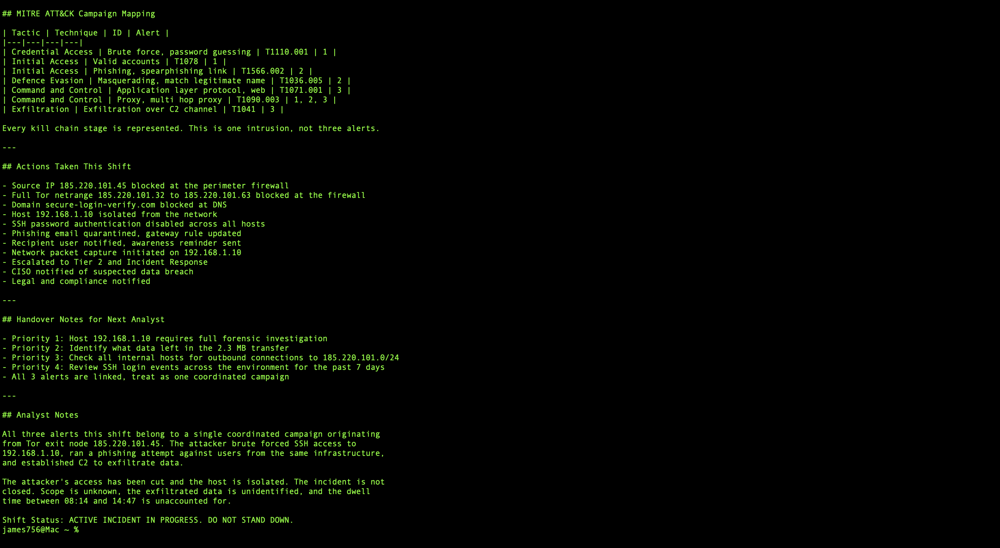

# Mock SOC Shift Simulation, Capstone

A full Tier 1 shift run end to end. Three alerts arrive eight hours apart and look unrelated. One shared IP proves they are the same attacker.

## At a Glance

| Field | Detail |
| --- | --- |
| Exercise Type | Tabletop SOC shift simulation, capstone |
| Shift Window | 08:00 to 16:00 |
| Alerts Handled | 3, one critical and two high |
| Disposition | 1 contained at Tier 1, 1 escalated to Tier 2, 1 escalated to IR |
| Compromised Host | 192.168.1.10 |
| Threat Origin | 185.220.101.45, Tor exit node |
| Key Finding | All three alerts correlate to a single coordinated campaign |

## What This Is

A scenario based shift exercise, not a live incident. The alerts, hosts, and timings are constructed. What is being exercised is the reasoning: triage under time pressure, containment before escalation, and the correlation that turns three tickets into one campaign.

The scenario is built to punish the most common Tier 1 failure, which is working each alert to closure in isolation. Every alert here is individually closeable. Block the IP, quarantine the email, isolate the host, done. Three clean tickets, three satisfied SLAs, and a campaign that nobody saw.

Everything in this exercise turns on noticing the same IP twice.

## Shift Start


Handoff received at 08:00, alert queue reviewed, SIEM and threat intelligence platform availability confirmed.

Tool readiness is checked before triage, not during it. The middle of a critical alert is a bad time to discover the enrichment platform is down.

## Alert 1, SSH Brute Force, 08:14

SOC-2026-001, severity High.

47 failed SSH attempts from 185.220.101.45.

One successful login. Host 192.168.1.10 compromised.

Action: source IP blocked, host isolated, escalated to Tier 2 with triage notes.

The single successful login is the entire alert. Forty seven failures is an attack that failed. Forty seven failures and one success is an attacker with a shell, and the difference between those two readings is one line in the log that a rushed analyst scrolls past.

Enrichment on the source IP returned a known Tor exit node. That fact goes in the notes and comes back later.

Containment ran before escalation. The host was isolated first, then handed off. Escalating an unisolated compromised host means the attacker keeps working during the handoff.

## Alert 2, Phishing Email, 10:32

SOC-2026-002, severity High.

Spoofed sender security@paypal.com. Sending IP 185.220.101.45.

Action: email quarantined, sender domain blocked. Contained at Tier 1.

This is the correlation point, and it is two hours after the first alert.

On its own this is a routine phishing ticket. Spoofed brand, hostile origin, quarantine and close. It only becomes something else because the sending IP is the same IP from 08:14, and the only reason that registered is that the source IP from Alert 1 was written down rather than just blocked.

An attacker who brute forces SSH and phishes a user from the same infrastructure is not two attackers. It is one operator working two paths into the same organisation.

## Alert 3, Data Exfiltration, 14:47

SOC-2026-003, severity Critical.

Compromised host 192.168.1.10 contacting external command and control. 2.3 MB outbound.

Action: escalated to the IR team as an active critical incident.

The host is the link. This is the same 192.168.1.10 that was compromised at 08:14, now sending data out.

That connection reclassifies the whole day. Alert 1 stops being a contained brute force and becomes the initial access stage of a breach. Alert 3 stops being an anomalous connection and becomes the objective. The attacker got in at 08:14 and took data at 14:47, and the six hours in between are now the question the IR team has to answer.

Data leaving makes this a potential breach, not just an intrusion, which is why it goes to IR and not Tier 2.

## Correlation




Two links tie the shift together.

The IP links Alert 1 to Alert 2. Same source, different attack path, same operator.

The host links Alert 1 to Alert 3. Compromised in the morning, exfiltrating in the afternoon.

Alert 1 is the hinge. It is the only alert that touches both of the others, and it is the one that would have been closed and forgotten if the source IP had been blocked without being recorded.

```
185.220.101.45 (Tor exit node)
   ├── 08:14  SSH brute force ──► 192.168.1.10 compromised
   │                                    │
   ├── 10:32  Phishing email            │
   │          spoofing PayPal           │
   │                                    ▼
   └── 14:47                    C2 contact, 2.3 MB exfiltrated
```

Three alerts. One IP. One campaign.

## Alert Summary

| Alert ID | Time | Severity | Description | Disposition |
| --- | --- | --- | --- | --- |
| SOC-2026-001 | 08:14 | High | SSH brute force, host compromised | Escalated to Tier 2 |
| SOC-2026-002 | 10:32 | High | Phishing email, spoofed PayPal | Contained at Tier 1 |
| SOC-2026-003 | 14:47 | Critical | Outbound C2, data exfiltration | Escalated to IR |

## Campaign Timeline

| Time | Event | Action |
| --- | --- | --- |
| 08:14 | 47 failed SSH attempts from 185.220.101.45 | Source IP blocked |
| 08:14 | 1 successful SSH login, 192.168.1.10 compromised | Host isolated, escalated to Tier 2 |
| 10:32 | Phishing email from the same IP, spoofing PayPal | Email quarantined, domain blocked |
| 14:47 | 192.168.1.10 contacts C2, 2.3 MB exfiltrated | IR team activated |

## Master IOC Table

| Type | Value | Appears In | Verdict |
| --- | --- | --- | --- |
| IP address | 185.220.101.45 | Alerts 1, 2, 3 | Malicious, Tor exit node |
| Domain | secure-login-verify.com | Alert 2 | Malicious phishing domain |
| Email | attacker@secure-login-verify.com | Alert 2 | Attacker controlled |
| Internal host | 192.168.1.10 | Alerts 1, 3 | Compromised |
| Data volume | 2.3 MB outbound | Alert 3 | Suspected breach |

The IP appears in all three rows of the day. That repetition is the finding, and it is only visible because the IOCs from each alert were recorded in a shared table rather than in three separate tickets.

## MITRE ATT&CK Campaign Mapping

| Tactic | Technique | ID | Alert |
| --- | --- | --- | --- |
| Credential Access | Brute force, password guessing | T1110.001 | 1 |
| Initial Access | Valid accounts | T1078 | 1 |
| Initial Access | Phishing, spearphishing link | T1566.002 | 2 |
| Defence Evasion | Masquerading, match legitimate name | T1036.005 | 2 |
| Command and Control | Application layer protocol, web | T1071.001 | 3 |
| Command and Control | Proxy, multi hop proxy | T1090.003 | 1, 2, 3 |
| Exfiltration | Exfiltration over C2 channel | T1041 | 3 |

Read down the tactic column and the kill chain is complete: credential access, initial access, evasion, command and control, exfiltration. That is not three alerts. That is an intrusion with every stage represented.

## Analyst Findings

Three alerts triaged during the shift, confirmed as one coordinated campaign.

Source IP 185.220.101.45 present in all three alerts, identified as a Tor exit node.

Host 192.168.1.10 compromised via brute force at 08:14 and exfiltrating at 14:47.

Phishing used the same infrastructure, indicating a second access path rather than a separate actor.

2.3 MB exfiltrated before containment, making this a suspected breach.

Two escalations, one Tier 1 containment, incident active at handoff.

## What Was Handed Off

Escalation package to Tier 2 on the brute force compromise with full triage notes and the isolation already applied.

Escalation to IR on the exfiltration as a critical active incident.

Master IOC table for organisation wide blocking.

End of shift report with the campaign correlation stated explicitly and the incident flagged as active.

The report says active, not resolved. Three alerts were handled and the incident is not over, and a handoff that blurs that distinction hands the next shift a false picture.

## What This Capstone Demonstrates

Running a shift from handoff to end of shift report rather than working a single alert.

Prioritising concurrent alerts by severity while keeping earlier alerts in scope.

Reading 47 failures and 1 success as a compromise, not a blocked attack.

Containing before escalating, so the handoff does not hand over an active foothold.

Recording IOCs into a shared table so correlation across an eight hour window is possible at all.

Correlating on a shared IP and a shared host to reclassify three tickets as one campaign.

Mapping a complete kill chain to MITRE ATT&CK across five tactics.

Producing escalation packages Tier 2 and IR can act on without re running the triage.

## Repository Structure

```
soc-day15-soc-shift-simulation/
├── README.md
├── reports/
│   ├── alert1_ssh_brute_force.md
│   ├── alert2_phishing_email.md
│   ├── alert3_suspicious_ip.md
│   └── end_of_shift_report.md
└── screenshots/
    ├── 01_reports_folder.png
    ├── 02_shift_summary.png
    └── 03_handover_notes.png
```

---

[](https://linkedin.com/in/WilliamInCyber)
[](https://x.com/WilliamInCyber)
