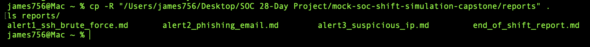
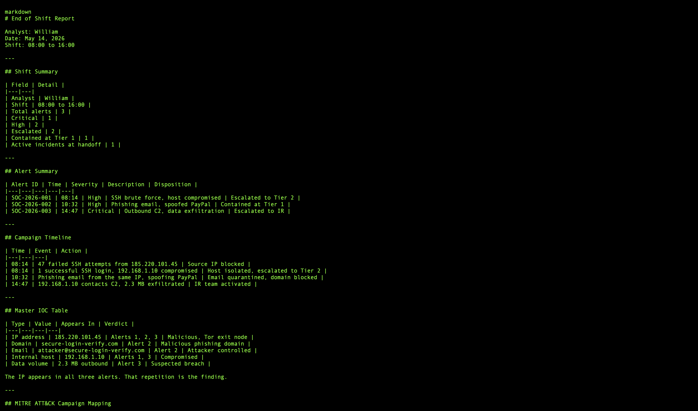

# Day 15 – SOC Tier 1 Incident Report: Mock SOC Shift Simulation Capstone

---

## Incident Summary

- **Incident Type:** Coordinated Multi-Stage Attack Campaign Full Shift Response
- **Severity:** Critical (Active Incident Data Exfiltration Confirmed, IR Team Activated)
- **Detection Method:** SIEM Alert Triage + Threat Intelligence Correlation + IOC Pivot Analysis
- **Tools Used:** SIEM, VirusTotal, AbuseIPDB, MXToolbox, Whois, MITRE ATT&CK Framework
- **Status:** Active Incident In Progress IR Team Activated

---

## Executive Summary

A full mock SOC shift simulation was conducted, tying together skills built across Days 1–14. Three alerts were triaged during the 08:00 AM 04:00 PM shift: an SSH brute-force attack, a phishing email campaign, and a suspicious outbound connection indicating data exfiltration.

All three alerts were correlated to a single coordinated attack campaign originating from Tor exit node `185.220.101.45`. The attacker compromised internal host `192.168.1.10`, attempted phishing against a company user, and exfiltrated 2.3 MB of data before being detected and contained. The incident remains active with the IR team engaged.

---

## Affected System

- **Analyst on Shift:** James (SOC Tier 1)
- **Shift Window:** 08:00 AM 04:00 PM
- **Compromised Host:** `192.168.1.10` (internal endpoint)
- **Threat Origin:** `185.220.101.45` (Tor exit node)
- **Alerts Handled:** 3 (1 Critical, 2 High) 2 Escalated, 1 Contained

---

## Investigation Methodology

### 1. Shift Start & Alert Queue Review



- Received SOC handoff at 08:00 AM and reviewed the alert queue
- Confirmed SIEM and threat intelligence platform availability
- Established baseline situational awareness for the shift

#### SOC Observations:

- Shift handoff and queue review are the foundation of SOC continuity
- Tool readiness checks must precede active triage
- Alert prioritization by severity drives the shift workflow

---

### 2. Alert 1 — SSH Brute Force (08:14 AM)

- SIEM alert `SOC-2026-001` (HIGH) fired at 08:14 AM
- Identified 47 failed SSH attempts from `185.220.101.45`
- Detected 1 successful login host `192.168.1.10` compromised
- Blocked source IP, isolated the host, escalated to Tier 2

#### SOC Observations:

- Brute force followed by a successful login is a confirmed compromise
- Source IP enrichment immediately flagged a known Tor exit node
- Containment preceded escalation host isolated before handoff

---

### 3. Alert 2 — Phishing Email (10:32 AM)

- Email gateway alert `SOC-2026-002` (HIGH) fired at 10:32 AM
- Identified a spoofed `security@paypal.com` sender
- Traced sending IP to `185.220.101.45` same Tor exit node as Alert 1
- Quarantined the email, blocked the sender domain marked Contained

#### SOC Observations:

- The shared source IP was the first signal of campaign-level correlation
- Spoofed brand sender + Tor origin is a classic phishing pattern
- Domain-level blocking prevents follow-up campaign waves

---

### 4. Alert 3 — Suspicious Outbound / Data Exfiltration (02:47 PM)

- SIEM alert `SOC-2026-003` (CRITICAL) fired at 02:47 PM
- Detected compromised host `192.168.1.10` contacting external C2
- Confirmed 2.3 MB of data exfiltrated over the channel
- Escalated to the IR team as an active critical incident

#### SOC Observations:

- Outbound C2 traffic from a known-compromised host confirms attacker objectives
- Data exfiltration escalates the incident to a potential data breach
- The compromised host ties Alert 3 directly back to Alert 1

---

### 5. Campaign Correlation & End of Shift Report



- Correlated all three alerts through shared IOCs to a single campaign
- Mapped the full attack chain: brute force → phishing → exfiltration
- Produced the End of Shift Report and flagged the active incident for IR

#### SOC Observations:

- IOC pivoting converts three isolated alerts into one coordinated campaign
- End-of-shift documentation is the backbone of SOC continuity
- Active incidents must be explicitly flagged in the handoff

---

## Alert Summary

| Alert ID | Time | Severity | Description | Status |
|---|---|---|---|---|
| SOC-2026-001 | 08:14 AM | HIGH | SSH Brute Force — Host Compromised | Escalated to Tier 2 |
| SOC-2026-002 | 10:32 AM | HIGH | Phishing Email — Spoofed PayPal | Contained |
| SOC-2026-003 | 02:47 PM | CRITICAL | Suspicious Outbound - Data Exfiltration | Escalated to IR Team |

---

## Full Attack Campaign Timeline

| Time | Event | Action Taken |
|---|---|---|
| 08:14 AM | SSH brute force from `185.220.101.45` — 47 attempts | Source IP blocked |
| 08:14 AM | 1 successful SSH login host `192.168.1.10` compromised | Host isolated |
| 10:32 AM | Phishing email from same Tor exit node spoofed PayPal | Email quarantined |
| 02:47 PM | Compromised host contacts C2 — 2.3 MB exfiltrated | IR team activated |

---

## Master IOC Table

| Type | Value | Source | Verdict |
|---|---|---|---|
| IP Address | `185.220.101.45` | All 3 Alerts | ❌ Malicious — Tor Exit Node |
| Domain | `secure-login-verify.com` | Alert 2 | ❌ Malicious — Phishing Domain |
| Email | `attacker@secure-login-verify.com` | Alert 2 | ❌ Attacker Email |
| Internal Host | `192.168.1.10` | Alert 1 + 3 | ❌ Compromised |
| Data Exfiltrated | 2.3 MB outbound | Alert 3 | ❌ Possible Data Breach |

---

## MITRE ATT&CK Campaign Mapping

| Behavior | Technique ID | Alert |
|---|---|---|
| Brute Force: Password Guessing | T1110.001 | Alert 1 |
| Valid Accounts | T1078 | Alert 1 + 3 |
| Phishing: Spearphishing | T1566.001 | Alert 2 |
| Masquerading | T1036.005 | Alert 2 |
| Exfiltration Over C2 Channel | T1041 | Alert 3 |
| Application Layer Protocol: Web | T1071.001 | Alert 3 |
| Proxy: Multi-hop Proxy | T1090.003 | All 3 Alerts |

---

## SOC Analyst Findings

- Three alerts triaged during the shift were confirmed as a single coordinated campaign
- Attacker used Tor exit node `185.220.101.45` across all three attack stages
- Internal host `192.168.1.10` was compromised via SSH brute force
- Phishing campaign leveraged the same infrastructure with a spoofed PayPal sender
- 2.3 MB of data was exfiltrated over a C2 channel before containment
- Two alerts escalated (Tier 2 and IR team), one contained at Tier 1
- Incident remains active with the IR team engaged

---

## SOC Analyst Response

- Blocked the malicious source IP at the perimeter firewall
- Network-isolated the compromised host to halt lateral movement and C2
- Quarantined the phishing email and blocked the sender domain
- Escalated the brute-force compromise to Tier 2 with full triage notes
- Escalated the data exfiltration event to the IR team as a critical incident
- Produced a master IOC table for organisation wide blocking
- Delivered a complete End of Shift Report flagging the active incident

---

## Analyst Insight

This capstone demonstrates the difference between handling alerts and running a shift. Any analyst can triage an SSH brute force, a phishing email, or an outbound connection in isolation. The skill that defines a SOC analyst is correlation recognising that a shared IP across three alerts, eight hours apart, is not coincidence but campaign. Connecting them turned three separate tickets into one high-fidelity incident with a clear attack chain, a full IOC set, and an actionable IR handoff.

---

## Learning Outcome

- Run a complete SOC Tier 1 shift from handoff to end-of-shift report
- Triage and prioritize multiple concurrent alerts by severity
- Correlate isolated alerts into a single coordinated attack campaign
- Apply containment, escalation, and documentation under shift conditions
- Build a master IOC table spanning multiple attack stages
- Map a full attack campaign to the MITRE ATT&CK framework
- Produce escalation packages for Tier 2 and IR teams
- Integrate skills from Days 1–14 into one operational workflow

---

## Repository Structure

```
mock-soc-shift-simulation-capstone/
├── README.md
├── reports/
│   ├── alert1_ssh_brute_force.md
│   ├── alert2_phishing_email.md
│   ├── alert3_suspicious_ip.md
│   └── end_of_shift_report.md
└── screenshots/
    ├── 01_reports_folder.png
    └── 02_shift_summary.png
```

---

## Conclusion

This capstone project demonstrates a complete SOC Tier 1 shift workflow. Three alerts were triaged, investigated, contained, and escalated using skills built across Days 1–14 SIEM detection, phishing analysis, threat intelligence, OSINT, MITRE ATT&CK mapping, and incident response. All three alerts were correlated into a single coordinated attack campaign leveraging Tor anonymisation. The shift produced a full campaign timeline, master IOC table, MITRE mapping, and IR escalation package proving real-world SOC readiness at the Tier 1 and Tier 2 level.
